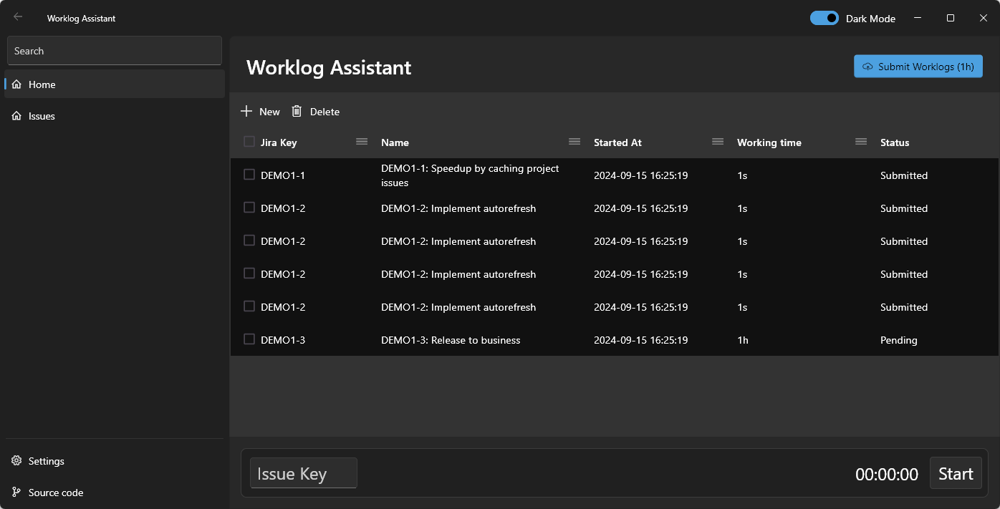

# Worklog Assistant

[](https://github.com/evolvedlight/WorklogAssistant/actions)
[](https://github.com/evolvedlight/WorklogAssistant/blob/main/LICENSE)
[](https://github.com/evolvedlight/WorklogAssistant/releases)

Worklog Assistant is an open source replacement for the Worklog Assistant tool that recently disappeared from the web.

## Table of Contents

- [Features](#features)
- [Installation](#installation)
- [Usage](#usage)
- [Contribution Guidelines](#contribution-guidelines)
- [External Resources](#external-resources)
- [License](#license)



## Features

- Track worklogs efficiently.
- Integrate with JIRA for issue tracking.
- Submit worklogs directly to JIRA.
- View and manage worklogs in a user-friendly interface.

## Installation

To install Worklog Assistant, follow these steps:

1. Clone the repository:
   ```sh
   git clone https://github.com/evolvedlight/WorklogAssistant.git
   ```
2. Navigate to the project directory:
   ```sh
   cd WorklogAssistant
   ```
3. Install dependencies:
   ```sh
   flutter pub get
   ```
4. Run the application:
   ```sh
   flutter run
   ```

## Usage

1. Open the Worklog Assistant application.
2. Connect to your JIRA instance by providing the necessary credentials.
3. Start tracking your worklogs by entering the issue key and starting the timer.
4. Submit your worklogs directly to JIRA.

## Contribution Guidelines

We welcome contributions from the community! To contribute to Worklog Assistant, follow these steps:

1. Fork the repository.
2. Create a new branch for your feature or bugfix:
   ```sh
   git checkout -b my-feature-branch
   ```
3. Make your changes and commit them:
   ```sh
   git commit -m "Add new feature"
   ```
4. Push your changes to your fork:
   ```sh
   git push origin my-feature-branch
   ```
5. Create a pull request on the main repository.

## Detailed Description

Worklog Assistant is designed to help you track and manage your worklogs efficiently. It integrates with JIRA to provide seamless issue tracking and worklog submission. The user-friendly interface allows you to view and manage your worklogs with ease.

### Purpose

The purpose of Worklog Assistant is to provide a reliable and efficient tool for tracking worklogs, especially for users who rely on JIRA for issue tracking. With Worklog Assistant, you can easily track your worklogs, manage them, and submit them directly to JIRA.

### Features

- **Track Worklogs**: Start and stop timers to track the time spent on different tasks.
- **JIRA Integration**: Connect to your JIRA instance and track issues directly from the application.
- **Submit Worklogs**: Submit your tracked worklogs directly to JIRA with a single click.
- **User-Friendly Interface**: View and manage your worklogs in an intuitive and easy-to-use interface.

## License

This project is licensed under the MIT License. See the [LICENSE](LICENSE) file for details.
